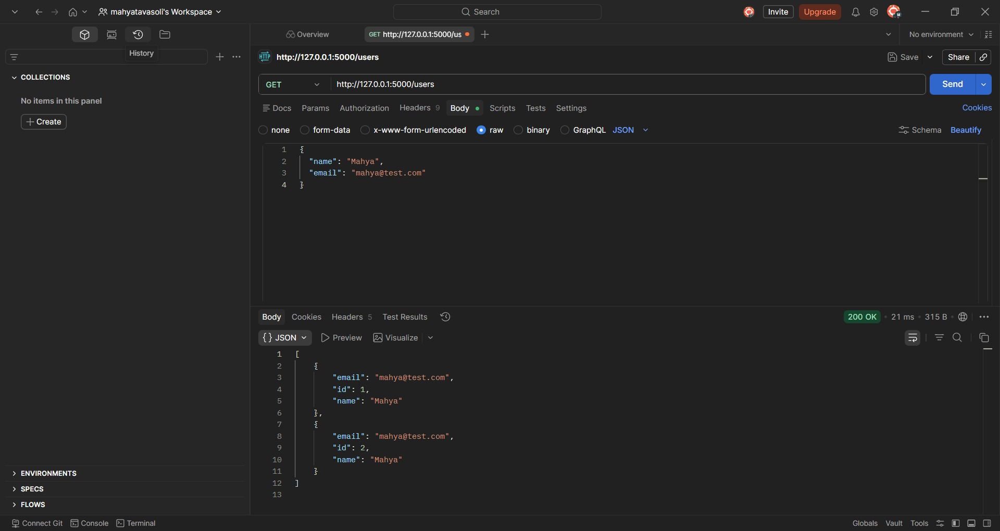

- User Management REST API

A RESTful API built with Flask for managing users.
This project demonstrates backend fundamentals including API design, CRUD operations, and database integration.

- Overview

This project was developed as part of my backend development practice.
It focuses on building a structured API using Python and Flask, following clean project organization.

- Tech Stack

Python
Flask
SQLite
Postman (API testing)
Git & GitHub

- Features

Create a new user
Retrieve all users
Retrieve a specific user by ID
Update user information
Delete a user

- API Endpoints

| Method | Endpoint    | Description     |
| ------ | ----------- | --------------- |
| POST   | /users      | Create user     |
| GET    | /users      | Get all users   |
| GET    | /users/<id> | Get single user |
| PUT    | /users/<id> | Update user     |
| DELETE | /users/<id> | Delete user     |

- How to Run the Project

git clone https://github.com/MahyaTavasoli/user-api.git

cd user-api

Create virtual environment:

python -m venv venv

venv\Scripts\activate

Install dependencies:

pip install -r requirements.txt

Run the server:

python app.py

The server will run on:

 http://127.0.0.1:5000

- Testing the API

You can test the API using Postman.

Example request

POST /users

{
  "name": "Mahya",
  "email": "mahya@test.com"
}

- What I Learned

Building RESTful APIs using Flask
Structuring backend projects
Working with SQLite databases
Testing APIs using Postman
Using Git and GitHub for version control

- Future Improvements

Add user authentication
Improve error handling
Add unit tests
Deploy the API

- Author

Mahya Tavasoli
